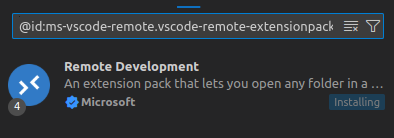
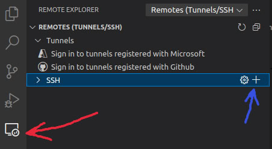
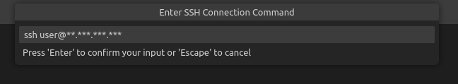

# Protocolo Secure Shell (SSH)

## Overview

SSH (Secure Shell) es un protocolo de red criptográfico que permite el acceso y gestión seguros de sistemas informáticos de manera remota.

### Definición y Funcionalidad

SSH permite la gestión segura de servidores desde cualquier ubicación
. El protocolo establece conexiones seguras entre cliente y servidor, permitiendo la autenticación de usuarios y la transferencia segura de datos.

### Componentes Principales

- Cliente SSH: Software que inicia las conexiones
- Servidor SSH (sshd): Demonió que maneja las conexiones entrantes
- Sistema de Autenticación: Basado en claves pública/privada
- Protocolo de Cifrado: Garantiza la seguridad de la comunicación

### Beneficios

- Acceso seguro desde cualquier ubicación
- Control completo del sistema
- Comunicación cifrada de extremo a extremo
- Capacidad de realizar tareas administrativas complejas

## Conectandonos a nuestro servidor usando SSH

Se estara viendo como hacer una conexion ssh desde nuestro sistema operativo hacia nuestro servidor virtual. En nuestro caso estaremos usando `Debian 12/ Ubuntu 22.0.4` como sistema operativo local.

### Conexión básica: Utiliza nombre de usuario y contraseña

``` bash
ssh usuario@direccion_ip
# Ejemplo:
ssh usuario@123.456.789.012
```

Este método usa el comando ssh básico digitalocean.com. Cuando te conectas por primera vez, recibirás una advertencia sobre la huella digital del servidor. Debes escribir `"yes"` para aceptarla, luego ingresar tu contraseña cuando se solicite.

#### Pros y Casos de uso

- Simple y rápido de configurar
- No requiere configuración previa
- Útil para conexiones ocasionales

### Configuración con claves SSH (método recomendado)

``` bash
# Generar claves en tu computadora
ssh-keygen -t rsa

# Copiar la clave pública al servidor
ssh-copy-id usuario@direccion_ip

# Conectar usando las claves
ssh usuario@direccion_ip
```

----
Una vez hayas terminado de ejecutar este bash, te aparecera en la consola algo parecido a esto:

```bash
Number of key(s) added: 1

Now try logging into the machine, with:   "ssh 'xxxx@xx.xxx.xxx.xxx'"
and check to make sure that only the key(s) you wanted were added.
```

----
Alternativamente si kieres comprobar tus llaves privadas puedes listar estas con el bash en `Ubuntu/Debian`

``` bash
ls -l ~/.ssh/id_rsa*
```

Debe lanzar un resultado parecido a este:

``` bash
rb58853@rb58853-Inspiron-7570:~$ ls -l ~/.ssh/id_rsa*
-rw------- 1 rb58853 rb58853 2675 May  4 17:27 /home/rb58853/.ssh/id_rsa
-rw-r--r-- 1 rb58853 rb58853  583 May  4 17:27 /home/rb58853/.ssh/id_rsa.pub
```

Para abrir la carpeta que contiene tus llaves ssh usando:

``` bash
open  ~/.ssh/
```

----

Este método genera un par de claves: una privada (que mantienes segura en tu computadora) y una pública (que se copia al servidor) digitalocean.com. Una vez configurado, las conexiones posteriores son automáticas y más seguras.

#### Pros y casos de uso

- Máxima seguridad
- No necesitas recordar contraseñas
- Ideal para conexiones frecuentes

### Resultado

Una vez hayas establecido conexion con el vps te aparecera algo parecido a lo mostrado en lo siguiente. En este caso se esta usando un VPS de del distribuidor [Contabo](https://contabo.com/) con sistema operativo instalado `Debian 12`.

``` bash
rb58853@rb58853-Inspiron-7570:~$ ssh root@xx.xxx.xxx.xxx
Linux vmi2084482.contaboserver.net 6.1.0-10-amd64 #1 SMP PREEMPT_DYNAMIC Debian 6.1.37-1 (2023-07-03) x86_64
  _____
 / ___/___  _  _ _____ _   ___  ___
| |   / _ \| \| |_   _/ \ | _ )/ _ \
| |__| (_) | .` | | |/ _ \| _ \ (_) |
 \____\___/|_|\_| |_/_/ \_|___/\___/

Welcome!

This server is hosted by Contabo. If you have any questions or need help,
please don't hesitate to contact us at support@contabo.com.

Last login: Sun May  4 23:55:46 2025 from 152.206.243.67
root@vmi2084482:~# 


```

Puede usar el comando `exit` para salir de la terminal del VPS.

## Conectandonos remoto a nuestro servidor usando Remote explorer SSH en VScode

En lo siguiente, se indica paso a paso como usar remote explorer en VsCode y conectar con nuestro servidor. Para lograr esto, es necesario [configurar ssh en nuestro SO y compartir llaves con nuestro VPS](#configuración-con-claves-ssh-método-recomendado)

- Instalar la extension [Remote Development](https://marketplace.visualstudio.com/items?itemName=ms-vscode-remote.vscode-remote-extensionpack). Para esto presione `Ctrl+p` y escriba `ext install ms-vscode-remote.vscode-remote-extensionpack`.

  

- Una vez instalada dicha extension, podras acceder al menu de remote explorer y agregar tu conexion SSH.

  

- Escribe la informacion pedida por VsCode para establecer conexion SSH, algo como `ssh user@xx.xxx.xxx.xxx`
.
  
- Una vez hayas completado los pasos anteriores, tu direccion servidor conectado por SSH te aparecera en tu lista de conexiones.
